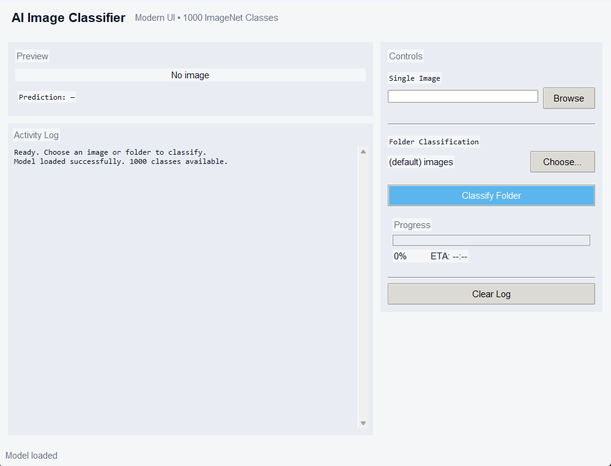

# AI Image Classifier (Python)

A modern AI image classification application built with Python and PyTorch.  
It uses a pretrained ResNet-18 model to classify images into 1000 ImageNet categories, with a clean GUI and real-time progress tracking.

---

## Features

### AI Classification
- Pretrained ResNet-18 (ImageNet model)
- Classifies images into 1000 classes
- Shows Top-5 predictions
- Displays confidence percentages
- Automatically downloads and caches ImageNet labels

### Single Image Mode
- Select and classify a single image
- Instant prediction results
- Preview image inside GUI
- Shows best-matching class with confidence

### Folder Classification Mode
- Classify all images in a folder
- Supports multiple formats (jpg, png, bmp, gif, etc.)
- Progress bar with percentage
- Estimated time remaining (ETA)
- Logs results for each image

### Graphical User Interface
- Built with Tkinter + ttk styling
- Modern theme
- Image preview panel
- Activity log window
- Status bar with live updates
- Thread-safe background processing (UI does not freeze)

---

## Technologies Used

- Python 3
- PyTorch
- Torchvision (ResNet-18 model)
- Pillow (PIL)
- Tkinter (GUI)
- ttk
- JSON
- urllib

---

## How to Run

1. Install dependencies:

pip install torch torchvision pillow

2. Run the program:

python classifier.py

---

## Required Files

- classifier.py
- images/ folder (optional for batch testing)
- Internet connection (first run only, for downloading labels)

---

## Notes

- First run downloads ImageNet labels automatically
- Uses pretrained model (no training required)
- Designed for educational AI + GUI development
- Folder mode processes images sequentially with progress tracking

---

## Author

AlexIsNotInset
